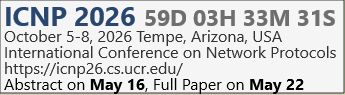
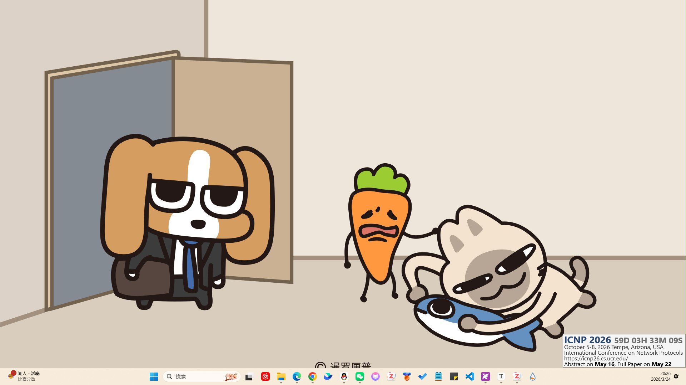

# ConferenceDeadlineWidget

A minimalist Rainmeter skin for conference deadline countdowns and event info.

一个简洁的 Rainmeter 桌面挂件，用于显示会议名称、会议信息和截稿倒计时。

## Preview





## Features

- Conference title
- Date and location
- Short conference description
- Important notes
- Deadline countdown
- Simple and clean card-style layout
- Easy customization through a separate data file

## Folder Structure

```text
ConferenceDeadlineWidget/
├─ README.md
├─ LICENSE
├─ screenshots/
│  └─ preview.png
└─ Skins/
   └─ ConferenceDeadlineWidget/
      ├─ ConferenceDeadlineWidget.ini
      ├─ ConferenceData.inc
      └─ Deadline.lua
```

## Installation

1. Install [Rainmeter](https://www.rainmeter.net/?utm_source=chatgpt.com).
2. Download this repository as a ZIP file.
3. Extract the folder.
4. Copy the `Skins/ConferenceDeadlineWidget` folder to your Rainmeter skins directory:

```
C:\Users\<YourUsername>\Documents\Rainmeter\Skins\
```

1. Open Rainmeter.
2. Refresh skins.
3. Load `ConferenceDeadlineWidget.ini`.

## Customization

You only need to edit:

```
Skins/ConferenceDeadlineWidget/Variables.inc
```

Example:

```
[Variables]
ConferenceName=ICNP 2026
ConferenceInfo=October 5-8, 2026 Tempe, Arizona, USA
ConferenceDesc=IEEE International Conference on Network Protocols
ConferenceNote=Abstract on May 16, Full Paper on May 22
Deadline=2026-05-22 23:59:59
```

### Fields

- `ConferenceName`
   The conference title
- `ConferenceInfo`
   Date and location
- `ConferenceDesc`
   A short description of the conference
- `ConferenceNote`
   Extra notes, such as abstract deadline or reminders
- `Deadline`
   Countdown target time in this format:

```
YYYY-MM-DD HH:MM:SS
```

Example:

```
2026-05-22 23:59:59
```

## Usage

After editing `ConferenceData.inc`, refresh the skin in Rainmeter to apply changes.

## Notes

- This skin is designed for desktop use on Windows with Rainmeter.
- The countdown depends on your local system time.
- Make sure the deadline format is correct, otherwise the countdown may not work properly.

## Roadmap

- More layout presets
- Better typography options
- More customizable card styles
- Multiple conference cards

## License

MIT